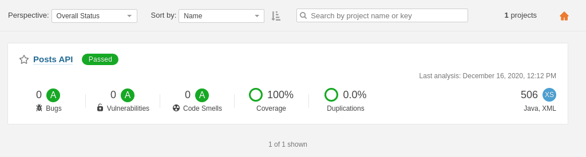
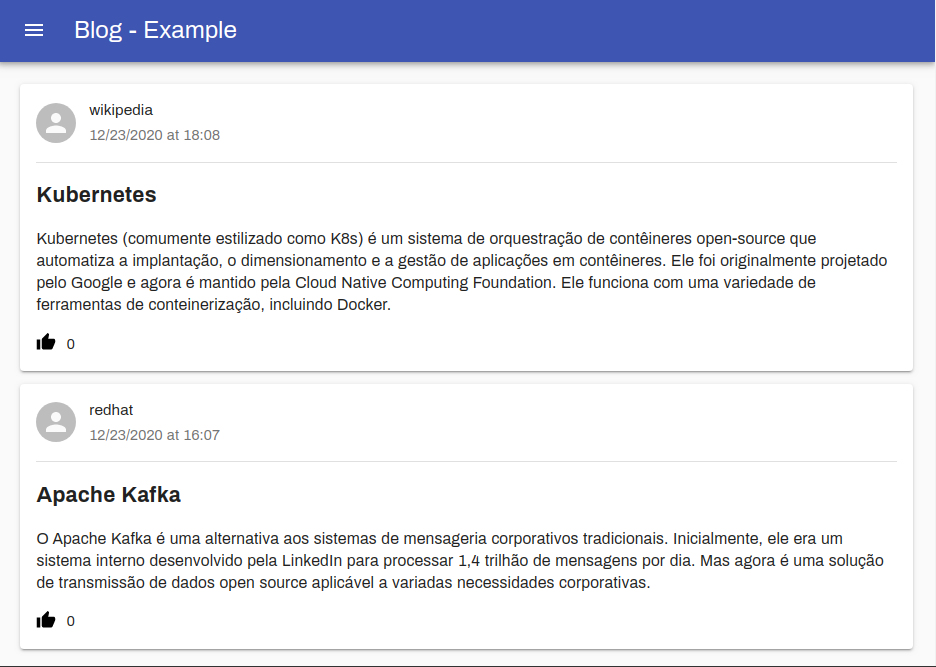

# Blog - Exemplo

Este repositório contém o código fonte de uma aplicação exemplo para cadastro e listagem de posts de um blog.

## :rocket: Tecnologias

Os serviços foram desenvolvidos sob o uso das seguintes tecnologias:

- [Java](https://www.java.com/)
- [SpringBoot](https://spring.io/)
- [PostgreSQL](https://www.postgresql.org/)
- [React JS](https://reactjs.org/)
- [Material UI](https://material-ui.com/)
- [TypeScript](https://www.typescriptlang.org/)
- [SonarQube](https://www.sonarqube.org/)
- [Swagger](https://swagger.io/)

<a target="_blank" href="https://www.java.com/">
  
</a>
<a target="_blank" href="https://spring.io/">
  
</a>
<a target="_blank" href="https://www.postgresql.org/">
  
</a>
<a target="_blank" href="https://reactjs.org/">
  
</a>
<a target="_blank" href="https://material-ui.com/">
  
</a>
<a target="_blank" href="https://www.typescriptlang.org/">
  
</a>
<a target="_blank" href="https://www.sonarqube.org/">
  
</a>
<a target="_blank" href="https://swagger.io/">
  
</a>
<br>
<br>

## Pré-requisitos

- Git
- Java 11+
- Maven 3.6.1+
- PostgreSQL
- Docker
- NodeJS

## Back-end

A aplicação back-end foi desenvolvida utilizando Java, Spring Boot e PostgreSQL. O código fonte esta disponível no diretório `back-end` e a porta de execução padrão é `8085`.

Os recursos REST estão documentados através do swagger. O arquivo YAML esta contido na raiz deste repositório como `swagger.yaml`. Por padrão a versão web pode ser acessada através do endpoint `http://localhost:8085/swagger-ui.html`.

Antes de iniciar a aplicação é necessário ter em execução o banco de dados PostgreSQL. Como facilitador foi disponibilizado o arquivo `/back-end/docker-compose.yaml` para criação de containers no ambiente [docker](https://www.docker.com/). Para executar, basta utilizar o seguinte comando:

```bash
docker-compose up -d
```

Para checar a qualidade do código também foi disponibilizado o container do [SonarQube](https://www.sonarqube.org/) no arquivo `/back-end/docker-compose.yaml`. Para capturar as métricas, podemos executar o seguinte comando:

```bash
mvn clean install && mvn sonar:sonar
```

Após o término da execução do comando acima, podemos acessar o endpoint `http://localhost:9000/projects` para consultar a página web. Por padrão o nome de usuário e senha são `admin`. Segue exemplo do painel de informações:



A execução dos testes de integração requer nenhuma configuração adicional ou infra-estrutura. Eles estão disponíveis no caminho `src/main/test/java/com/segware/posts/api/integration`.

# Front-end

A aplicação front-end foi desenvolvida utilizando ReactJS e esta disponível no diretório `web`.

Para execução do serviço é necessário que o back-end esteja em execução e posteriormente devemos executar o seguinte comando.

```bash
# se estiver utilizando Yarn
yarn start
```

```bash
# se estiver utilizando NPM
npm start
```

A página web pode ser acessar através do endpoint `http://localhost:3000/`. Se tudo ocorrer bem, o resultado será como este:



`Observação:` por padrão duas postagens serão criadas pela aplicação back-end.
